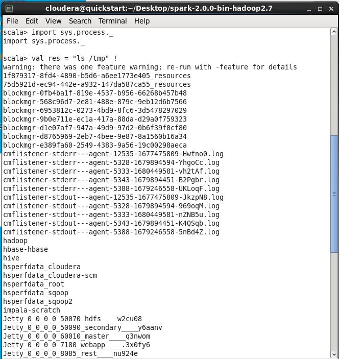

# SPARK

Nama   : Annisa Aulia Nadhila

Kelas  : TI - 3C

NIM  : 2041720023

## Screenshoot hasil pengerjaan
Menjalankan service dari pyspark terlebih dahulu


#### 1. Accumulator.py

Hasil : Berhasil. Fungsi accumulator (bertujuan akumulasi shared variable) berhasil dijalankan dengan output "4950".


### 2. BroadCast.py


variabel broadcast  adalah variabel bersama hanya-baca yang di-cache dan tersedia di semua node dalam cluster agar dapat diakses atau digunakan oleh tugas. Alih-alih mengirimkan data ini bersama dengan setiap tugas, PySpark mendistribusikan variabel siaran ke pekerja menggunakan algoritme siaran yang efisien untuk mengurangi biaya komunikasi.

Hasil : Berhasil. 
Fungsi BroadCast berhasil dijalankan dengan output range 1 - 100.

### 3. LogAnalytics.py


Hasil : menampilkan jumlah error yang ada pada cached_log dan jumlah halaman yang dikunjungi

### 4. PairRDD.py


Langkah 1: Buat RDD menggunakan Spark Context

Langkah 2 : Transformasi: Ketika operasi map() diterapkan pada RDD ini, blok baru, yaitu "my", "pair", dan "rdd", dibuat sebagai RDD baru, yang tidak dapat diubah lagi. Semua fungsi terjadi di Memori. Catatan: "my", "pair", dan "rdd", masih ada seperti aslinya.

Langkah 3: Tindakan: Saat collect(), hasil sebenarnya dikumpulkan dan dikembalikan.

Hasil : Berhasil. fungsi dasar dari sebuah collection.

### 5. UnderstandingRDD.py


Hasil : Berhasil. Membuat sebuah list, dengan mempraktikan yaitu menghitung jumlah partisi, elemen, menampilkan data pada collection, dan memodifikasi collection (menambahkan atau mengurangi).


### 6. WordCount.py


Langkah 1: Kami membuat SparkContext untuk menghubungkan Driver yang berjalan secara lokal.


Langkah 2: Selanjutnya, kita membaca file teks masukan menggunakan variabel SparkContext dan membuat peta datar kata-kata. Kata-kata bertipe PythonRDD.

Langkah 3: Kami membagi kata menggunakan satu spasi sebagai pemisah.

Kemudian kami akan memetakan setiap kata ke kunci: nilai pasangan kata:1, 1 menjadi jumlah kemunculan.

Langkah 4: Hasilnya kemudian dikurangi dengan kunci, yaitu kata, dan nilainya ditambahkan.

Langkah 5: hitung dan kumpulkan

Hasil : Berhasil. Menghitung jumlah kata yang ada dalam file log.txt


## UJI COBA SPARK SCALA

Menjalankan service dari sparkshell terlebih dahulu dengan perintah

```python
cd spark-2.0.0-bin-hadoop2.7
```

```python
bin/spark-shell
```


Jalankan juga service cloudera manager dengan perintah:

```python
sudo /home/cloudera/cloudera-manager --express --force

```


### 1. SystemCommandsOutput.scala


Hasil dari percobaan diatas adalah string "" dan result = , dikarenakan tidak terdapat file yang akan dihadoop

### 2. SystemCommandsReturnCode.scala



Dari percobaan diatas, menampilkan folder yang berisi temp file

## TUGAS 2

Jelaskan masing-masing maksud kode berikut sesuai nomor kode.

Kode 1: sc, accumulator, parallelize, lambda, value

Kode 2: broadcast, list, range

Kode 3: textFile, filter, cache, count

Kode 4: map, collect, len, keys, values

Kode 5: defaultParallelism, getNumPartitions, mapPartitionsWithIndex, repartition, coalesce, toDebugString

Kode 6: flatMap, reduceByKey, split

## JAWABAN :

### Kode 1


1. sc = sc adalah singkatan dari SparkContext, yang merupakan gateway/gerbang utama untuk fungsionalitas Spark.

2. accumulator = adalah variabel yang dapat diakses oleh semua pekerja dalam cluster dan digunakan untuk mengakumulasikan hasil dari operator paralel

3. parallelize = adalah metode SparkContext yang digunakan untuk membuat RDD (Resilient Distributed Dataset) dari kumpulan data pengontrol aplikasi. Metode paralel membagi pengumpulan data menjadi beberapa bagian (sections) dan secara otomatis mendistribusikannya ke node pekerja cluster, yang memungkinkan proses perhitungan paralel untuk setiap node pekerja.

4. lamda = adalah fungsi anonim dari bahasa pemrograman Python yang digunakan untuk mengubah data menggunakan RDD (Resilient Distributed Dataset) di Spark. Lambda mengurangi penulisan kode yang berlebihan dan mempercepat proses pemrograman.

5. value = merupakan kumpulan data yang dapat dibagi menjadi beberapa bagian (section) dan didistribusikan ke beberapa node cluster, yang memungkinkan proses komputasi paralel pada setiap node 

### Kode 2

1. Broadcast = Broadcast adalah variabel adalah variabel read-only bersama yang di-cache dan tersedia di semua node dalam sebuah cluster untuk mengakses atau digunakan oleh tugas-tugas

2. list = list adalah struktur data dalam Python yang menampung kumpulan/tupel item. Daftar item diapit tanda kurung siku, seperti [data1, data2, data3].

3. range = Buat RDD baru dari int yang berisi elemen dari awal hingga akhir (eksklusif), tingkatkan setiap elemen secara bertahap. Dapat dipanggil dengan cara yang sama seperti fungsi range() bawaan python. Jika dipanggil dengan satu argumen, argumen tersebut ditafsirkan sebagai akhir, dan mulai diatur ke 0.

### kode 3

1. textfile= adalah salah satu metode yang digunakan untuk membaca file teks di Spark dan mengubahnya menjadi RDD (Resilient Distributed Dataset).

2. filter = adalah salah satu operasi transformasi Resilient Distributed Dataset (RDD) yang digunakan untuk memfilter item RDD berdasarkan kondisi yang diberikan.

3. cache= adalah salah satu metode yang digunakan untuk menyimpan RDD (Resilient Distributed Dataset) dalam memori node cluster.
Teknik ini memungkinkan RDD, yang sering digunakan dalam operasi dan fungsi konversi, untuk disimpan dalam memori, sehingga mengurangi waktu yang diperlukan untuk memproses RDD.

4. count = adalah fungsi yang digunakan untuk menghitung jumlah elemen dalam Resilient Distributed Dataset (RDD). Fungsi ini mengembalikan bilangan bulat yang mewakili jumlah elemen di RDD. 


### Kode 4


1. map = map adalah fungsi di Spark yang digunakan untuk melakukan transformasi pada setiap elemen RDD menggunakan fungsi yang diberikan sebagai argumen. Fungsi ini mengembalikan RDD baru yang berisi hasil transformasi.

2. collect = collect adalah fungsi di Spark yang digunakan untuk mengambil semua elemen RDD dan mengembalikan hasilnya sebagai daftar di program driver. Fungsi ini tidak disarankan untuk RDD yang sangat besar karena dapat menyebabkan kerusakan memori.

3. len = len adalah fungsi bahasa pemrograman Python yang digunakan untuk menghitung jumlah elemen dalam daftar atau tipe data lain yang panjangnya dapat dihitung. keys = keys adalah metode kamus data dalam bahasa pemrograman Python yang mengembalikan daftar yang berisi semua kunci dalam kamus.

5. value = value adalah metode mirip kamus dalam bahasa pemrograman Python yang mengembalikan daftar yang berisi semua value dalam kamus. 


### Kode 5

1. defaultParallelism = adalah pengaturan yang menentukan jumlah partisi default yang akan dibuat saat membuat Resilient Distributed Dataset (RDD) baru di Spark.

2. getNumPartitions = adalah fungsi di Spark yang digunakan untuk mendapatkan jumlah partisi dari RDD (Resilient Distributed Dataset) yang dibuat di Spark.
Fungsi GetNumPartitions() tidak memerlukan argumen dan mengembalikan nilai bilangan bulat yang mewakili jumlah partisi RDD. 3. mapPartitionsWithIndex = adalah fungsi Spark yang memungkinkan pengguna melakukan pemrosesan pada setiap partisi dari Resilient Distributed Dataset (RDD) yang memiliki akses ke indeks partisi. Fungsi ini menerima sebagai argumen sebuah fungsi untuk diterapkan ke setiap partisi RDD, fungsi ini menerima dua argumen, yaitu indeks partisi dan iterator yang berisi semua elemen dari partisi tersebut.

4. coalesce = adalah fungsi Spark yang digunakan untuk memindahkan data secara acak dari satu partisi ke partisi lainnya, memungkinkan pengguna mengatur ulang disk RDD dan meningkatkan beban pada cluster Spark. 5. Merge = adalah fungsi Spark yang digunakan untuk mengurangi jumlah partisi RDD (Resilient Distributed Dataset) menjadi nilai yang lebih kecil. Fitur ini sangat berguna untuk mengurangi overhead cluster Spark dan meningkatkan kinerja operasi RDD.

6. toDebugString = adalah fungsi Spark yang digunakan untuk menampilkan informasi detail tentang RDD (Resilient Distributed Dataset) di log. Fitur ini berguna untuk memudahkan penggunaan Spark untuk men-debug dan menyetel pengoperasian RDD. 


### Kode 6

1. flatMap = flatMap adalah fungsi di Spark yang mirip dengan fungsi peta tetapi berbeda dalam penggunaannya. Fungsi ini digunakan untuk mengembalikan nol atau lebih elemen dari setiap elemen RDD yang diberikan sebagai argumen. Fungsi ini mengembalikan RDD baru yang berisi semua item yang dibuat.

2. reductionByKey = reductionByKey adalah fungsi di Spark yang digunakan untuk menghitung jumlah nilai dari setiap kunci di RDD. Fungsi ini mengelompokkan item berdasarkan kunci yang sama dan menggabungkan nilai untuk setiap kunci menggunakan fungsi agregat tertentu. Hasilnya adalah RDD baru yang berisi setiap kunci dengan nilai total yang sesuai.

3. split = split adalah fungsi bahasa pemrograman Python yang digunakan untuk membagi string menjadi beberapa substring berdasarkan pembatas. Fungsi ini mengembalikan daftar substring tersebut. 