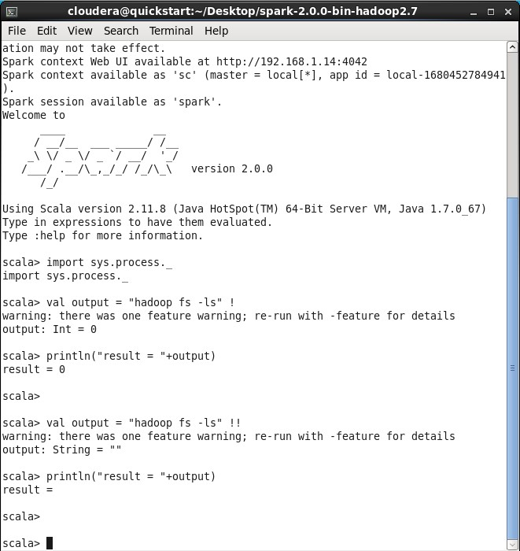

# SPARK

Nama   : Annisa Aulia Nadhila

Kelas  : TI - 3C

NIM  : 2041720023

## Screenshoot hasil pengerjaan
Menjalankan service dari pyspark terlebih dahulu

1. Accumulator.py

Hasil : Berhasil. Fungsi accumulator (bertujuan akumulasi shared variable) berhasil dijalankan dengan output "4950".

2. BroadCast.py

Hasil : Berhasil. Fungsi BroadCast berhasil dijalankan dengan output range 1 - 100.

3. LogAnalytics.py

Hasil : menampilkan jumlah error yang ada pada cached_log dan jumlah halaman yang dikunjungi

4. PairRDD.py

Hasil : Berhasil. fungsi dasar dari sebuah collection.

5. UnderstandingRDD.py

Hasil : Berhasil. Membuat sebuah list, dengan mempraktikan yaitu menghitung jumlah partisi, elemen, menampilkan data pada collection, dan memodifikasi collection (menambahkan atau mengurangi).

6. WordCount.py

Hasil : Berhasil. Menghitung jumlah kata yang ada dalam file log.txt

## UJI COBA SPARK SCALA

Menjalankan service dari sparkshell terlebih dahulu dengan perintah

cd spark-2.0.0-bin-hadoop2.7

bin/spark-shell

Jalankan juga service cloudera manager dengan perintah:

sudo /home/cloudera/cloudera-manager --express --force

1. SystemCommandsOutput.scala

2. SystemCommandsReturnCode.scala
